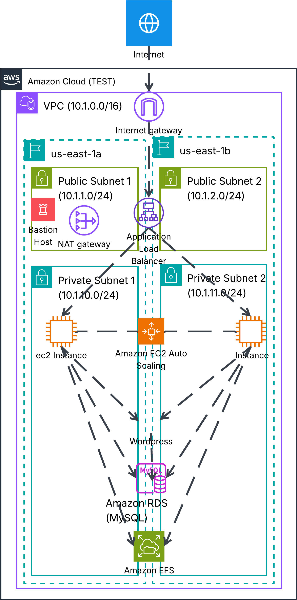

aws-cloudformation-wordpress

# High-Availability WordPress Infrastructure Automation (AWS CloudFormation)

## 📌 Project Overview
This repository contains a production-ready, highly available, and secure infrastructure automated completely via **AWS CloudFormation** (Infrastructure as Code - IaC). The template deploys a scalable WordPress architecture connected to a Multi-AZ MySQL database and shared network storage.

---

## 🗺️ Architecture Diagram

---

## ⚙️ Deployment Flow & Dependencies
The entire architecture is contained within a **Single Stack**, meaning zero manual parameter rewriting between multiple templates. AWS CloudFormation automatically handles resource creation using `!Ref` and `!GetAtt` intrinsic functions according to the following logic:

1. **Network Infrastructure (VPC, Subnets, Gateways, Route Tables):** The foundation of the entire system, built before any computing resources.
2. **Security Groups:** Provisioned immediately after the network to ensure firewall rules and isolation layers are active before compute components spin up.
3. **Data Layer (AWS EFS & Amazon RDS):** Deployed before EC2 application instances. Compute nodes must have data layers ready to mount filesystems and inject database configurations during boot.
4. **Load Balancer & Auto Scaling Group:** Deployed last. Once the core infrastructure is live, the Auto Scaling group provisions instances, triggers the initialization script (`UserData`), and the Application Load Balancer executes health checks.

---

## 📑 Detailed Component Breakdown & Rationale

### 1. Network Infrastructure (VPC & Subnets)
* **Description:** A customized VPC with a `10.1.0.0/16` CIDR block, segmented into 4 separate `/24` subnets. It features two public subnets (`PubSub1`, `PubSub2`) designated for the Application Load Balancer and two private subnets (`PrivSub1`, `PrivSub2`) isolated for the WordPress application nodes and the database cluster. All resources are balanced across two distinct Availability Zones (AZs).
* **Rationale:** This design enforces tight security. External internet traffic can only reach the public Load Balancer. The core application servers and database are kept entirely private. In order for internal instances to securely download packages or updates from the web, outbound traffic is safely routed through an AWS `NatGateway`.

### 2. Bastion Host (Jump Box)
* **Description:** A cost-effective `t3.micro` EC2 instance provisioned inside the public subnet `PubSub1` and locked down with a dedicated `BastionSG` firewall rule.
* **Rationale:** Because the production application servers are hidden inside private subnets without public IP addresses, they cannot be accessed directly from the outside world. The Bastion Host serves as a secure entry point. An administrator can SSH into the Bastion and securely jump into the private tier for maintenance or debugging.

### 3. Distributed Storage (AWS EFS)
* **Description:** A managed, network-attached AWS Elastic File System with active mount targets established inside both private subnets.
* **Rationale:** Because EC2 instances are dynamic and will scale up or down automatically via the Auto Scaling group, the application layer must remain stateless. AWS EFS is mounted directly to `/var/www/html` across all instances. If a user uploads an image or asset through one server, the change is instantly visible across the entire cluster.

### 4. Database Layer (Amazon RDS MySQL)
* **Description:** A fully managed Amazon RDS MySQL database instance completely isolated inside a private database subnet group (`DBSubnetGroup`).
* **Rationale:** Utilizing a managed service eliminates the operational overhead of manual database patching and automated backups. The database engine operates behind a strict firewall, listening exclusively on port `3306` and accepting traffic only from verified application security groups.

### 5. Elastic Load Balancing & Auto Scaling
* **Description:** An internet-facing Application Load Balancer (`MyALBFinal`) listening on port `80` that targets a dynamic Auto Scaling Group (`WPASG`). The scaling policy uses `TargetTrackingScaling` tracking average CPU utilization with a strict target value of 70%.
* **Rationale:** This ensures high availability and seamless traffic distribution. The ALB handles continuous health checks on the root path (
